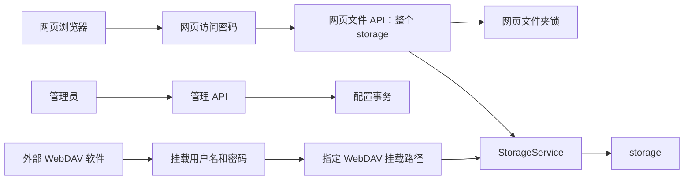

# Ycloud 当前版本说明

本文档只描述仓库当前版本，不记录旧版本和修改历史。

## 设计原则

### 稳定

- 文件上传先写临时文件，完成同步后再提交，失败不会留下半文件。
- 配置修改串行执行，先持久化成功，再发布到内存读取者。
- 配置保留最后一份有效备份，主配置异常时自动恢复。
- 所有请求有统一错误格式、请求 ID、超时和健康检查。
- 服务支持优雅关闭，停止时等待活动请求结束。

### 安全

- 默认只监听本机地址。
- 管理员会话、网页访问令牌和文件夹解锁令牌均由服务端保存。
- Cookie 使用 `HttpOnly` 和 `SameSite=Strict`，公网 HTTPS 可启用 `Secure`。
- 修改请求执行同源检查，页面执行严格内容安全策略。
- 所有文件路径均在规范化后验证，不能逃逸存储根目录。
- 密码使用 Argon2 哈希，管理 API 只返回“是否已设置”，不返回哈希。
- WebDAV 不允许匿名访问，启用的挂载必须设置用户名和密码。

### 高性能

- 上传、下载和预览使用流式 I/O，不把完整大文件载入内存。
- 下载支持单区间 Range 请求。
- I/O 和 Argon2 计算具有独立并发上限。
- 目录列表数量有上限，防止超大目录耗尽内存。
- 目录复制使用迭代遍历，不使用深递归。
- 文件夹锁在单次列表请求中使用配置快照，不对每个文件重复读取配置。
- 毛玻璃模糊只用于顶栏和大面板，不应用到每一行文件，保持滚动性能。

## 访问边界



三条认证通道相互独立：

| 通道 | 认证 | 范围 |
|---|---|---|
| 网页文件浏览 | 网页访问密码或管理员会话 | 整个 `storage` |
| 网页文件夹锁 | 对应文件夹锁密码 | 指定网页目录及其子目录 |
| WebDAV | 挂载用户名和密码 | 指定挂载路径 |
| 后台管理 | 管理员用户名和密码 | 配置管理 |

网页文件夹锁对所有网页身份生效，包括管理员会话。文件夹锁不影响 WebDAV；WebDAV 由挂载路径、密码和只读设置独立控制。

## 密码语义

- 管理员密码必须存在，只能替换，不能删除。
- 网页访问密码可以删除；删除后访问首页会自动进入文件空间，文件夹锁仍然生效。
- WebDAV 启用时必须存在用户名和密码；停用后可以删除保存的密码。
- 文件夹锁必须有密码；取消保护应删除整个锁。
- 管理界面使用 `••••••` 表示密码已设置。该文本不是密码，也不会作为密码提交。

## 路径语义

用户界面统一使用绝对外观显示路径：

- 存储根目录显示为 `/`
- `test`、`/test`、`/test/` 保存后统一显示为 `/test`
- 子目录统一显示为 `/父目录/子目录`
- 文件浏览面包屑使用目录外观：`/test/`、`/test/sub/`，各级目录仍可分别点击返回

配置内部保存相对于 `storage` 的路径，不保存开头和结尾的 `/`。WebDAV 挂载和网页文件夹锁使用相同的路径规范化规则。

路径禁止包含反斜杠、空字节、Windows 盘符和 `..` 父目录跳转。磁盘访问还会验证已存在父目录的规范路径，阻止符号链接逃逸。

## WebDAV

WebDAV 入口格式：

```text
http://主机:端口/dav/挂载名称/
```

当前实现是 WebDAV Class 1 子集，支持：

- `OPTIONS`
- `PROPFIND`
- `GET`
- `HEAD`
- `PUT`
- `DELETE`
- `MKCOL`
- `MOVE`
- `COPY`

不声明或模拟未完整实现的 Class 2 锁。`LOCK`、`UNLOCK` 和 `PROPPATCH` 返回未实现。MOVE/COPY 不进行隐式覆盖，客户端必须先显式删除目标。

## 网页界面

登录页、文件浏览器、后台和预览页共享 `static/theme.css`：

- 全部页面提供白天和黑夜两套主题；白天使用浅灰背景与白色面板，黑夜使用近黑背景与深灰面板，选择保存在当前浏览器
- 所有页面复用同一套颜色变量、圆角、描边、阴影、间距和蓝色强调色，不单独制造页面风格
- 文件类型使用本地 SVG 图标；非文件类操作图标统一采用 Lucide 的 24×24 轮廓语言、2px 圆角描边和一致的光学尺寸
- 所有图标静态嵌入项目，不加载外部字体、脚本或网络资源
- 文件页顶栏左侧保留品牌，当前目录搜索严格居中，管理员、新建文件夹、上传文件、主题切换和退出位于右侧
- 搜索只过滤已加载的当前目录条目，不进行高成本递归磁盘扫描，也不提供键盘快捷键
- 顶栏使用用户盾牌表示管理员，并显示新建文件夹、上传文件、主题切换和退出五个无文字图标；同一工具栏统一为 20px 显示尺寸，并保留辅助标签和工具提示
- 文件列表采用 1280 px 最大内容宽度和紧凑表格布局：桌面端 41 px 行高、轻量文件类型图标，并在宽屏两侧保留稳定留白；名称、修改时间、大小约按 52% / 32% / 16% 分布
- 文件选中或悬停背景与横向分隔线使用相同的左右端点；选中背景使用中性的灰白色，不用强调色干扰文件类型图标
- 选中框使用实心蓝底和白色对勾，未选中框保持中性描边
- 表头和每个文件行的横向分隔线在内容区左右各延伸 12px，最后一行也保留底部分隔线
- 选择文件后页面顶部不出现临时操作栏；单选和多选的移动、复制、删除统一收纳在文件右键菜单中
- 文件双击直接打开或预览，右键菜单不重复提供预览；菜单使用统一图标、分组和危险操作颜色，不显示快捷键提示
- 文件夹解锁弹窗使用密码输入框，重命名弹窗使用普通文本输入框；确认弹窗不创建输入框
- 账户设置的管理员用户名、管理员密码和网页访问密码输入框保持同一水平基线
- 后台卡片标题不重复展示功能说明；账户密码输入框不常驻展示可由保存校验表达的辅助文字
- 文件浏览页的根路径显示为 `/`，子目录连续显示为 `/test/`，不重复插入分隔符

文件列表保持表格式虚拟轻量结构，不为所有文件生成缩略图，避免大目录滚动时增加解码和内存成本。

## 局域网监听

- 默认监听 `0.0.0.0:3000`，供本机和可信局域网中的 WebDAV 客户端连接；仅本机使用时显式设置 `BIND_ADDRESS=127.0.0.1`。
- 网页访问密码为空时，只有回环地址可以获取无密码网页授权；局域网设备仍必须通过管理员会话或 WebDAV 挂载自己的 Basic 认证访问文件。
- 只在可信专用网络中开放 TCP 3000 端口；程序不把 HTTP 伪装成加密传输。
- WebDAV 客户端路径固定为 `/dav/挂载名称`；WebDAV 用户名和密码与网页密码、管理员密码相互独立。
- WebDAV 认证失败返回带 `WWW-Authenticate: Basic` 的 `401` 响应，使桌面端和移动端客户端能够按标准发起凭据重试。

## 后端模块

| 模块 | 当前职责 |
|---|---|
| `main.rs` | 进入异步运行时 |
| `bootstrap.rs` | 启动、监听、清理任务和优雅关闭 |
| `app.rs` | 路由、中间件、限制和嵌入式静态资源 |
| `auth.rs` | 会话、访问令牌、密码计算、登录和认证中间件 |
| `security.rs` | Cookie、CSRF 和安全响应头 |
| `state.rs` | 运行状态和配置更新事务 |
| `config.rs` | 配置模型、迁移、校验、保存和备份恢复 |
| `storage.rs` | 安全路径解析、流式 I/O、原子写入和文件操作 |
| `file_access.rs` | 网页文件授权、路径组合和文件夹锁判断 |
| `api.rs` | 单项网页文件 API |
| `batch_api.rs` | 批量删除、移动和复制 |
| `admin_api.rs` | WebDAV 挂载、文件夹锁和账户配置 |
| `webdav.rs` | WebDAV 方法处理和 Basic 认证 |
| `webdav_path.rs` | WebDAV 路径、Destination 和编码 |
| `webdav_xml.rs` | PROPFIND XML 响应 |
| `error.rs` | 统一应用错误与响应格式 |

## 配置结构

运行配置包含：

- 管理员用户名及密码哈希
- 可选网页访问密码哈希
- 网页文件夹锁列表
- WebDAV 挂载列表

每个 WebDAV 挂载具有稳定 ID、名称、相对路径、用户名、可选密码哈希、启用状态和只读状态。每个文件夹锁具有稳定 ID、相对路径和密码哈希。

监听地址、端口、存储目录、上传限制、并发限制和请求超时来自环境变量，不在运行配置中维护重复来源。

## 当前边界

- 程序本身不终止 TLS，公网部署需要 HTTPS 反向代理。
- 会话和解锁令牌保存在内存中，重启后失效。
- 单个配置文件只支持单进程写入，不支持多个实例同时修改。
- 目录列表达到 `MAX_LIST_ENTRIES` 后截断并向网页显示提示。
- 文本和 Markdown 预览按纯文本显示，不执行文件中的活动内容。
