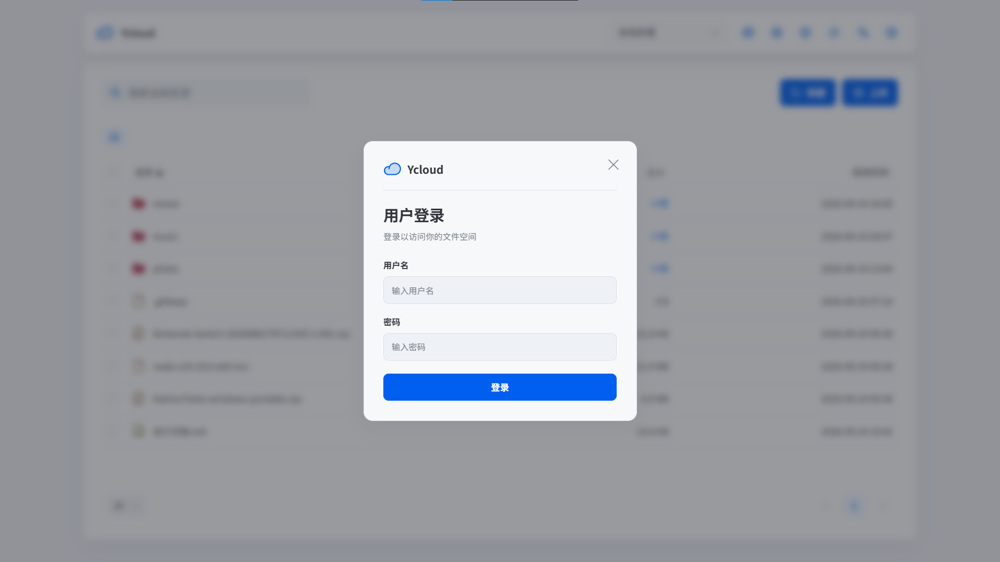
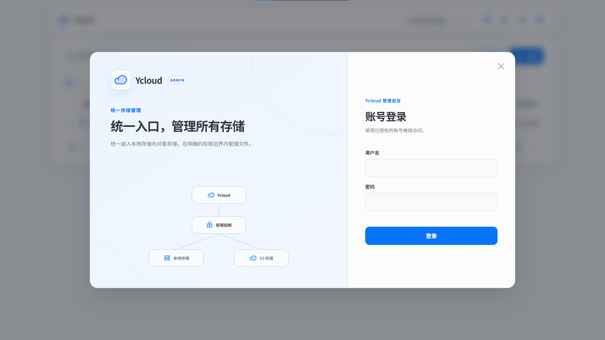

# Ycloud

Rust + Vue 构建的自托管文件管理服务，支持本地存储和 S3 兼容对象存储。

## 功能

- 本地存储、阿里云 OSS、腾讯云 COS、MinIO、RustFS 和通用 S3。
- 上传、下载、预览、搜索、移动、复制、重命名、删除和 ZIP 归档；文件页可切换为每页 20 张的图片画廊，支持 JPG、JPEG、PNG、WebP、AVIF 和 GIF。
- 管理员、访客、普通用户和 WebDAV 独立授权。存储的“允许访客访问”只控制无账号的网页访客，不替代 WebDAV 挂载自身的用户名和密码；停用存储后，所有入口都会拒绝新操作。
- 文件夹锁、TOTP、登录限制、访问日志和传输限制。
- 流式传输、本地原子写入、事务恢复和 S3 Multipart。

文件页右上角的用户图标用于普通用户登录，登录后点击查看账号及当前存储权限；盾牌为管理员入口。普通用户由管理员创建，两个入口分别验证对应角色的账号。

## 界面

<table>
  <tr>
    <th>访客入口</th>
    <th>文件管理</th>
  </tr>
  <tr>
    <td></td>
    <td></td>
  </tr>
  <tr>
    <th>普通用户登录</th>
    <th>管理员登录</th>
  </tr>
  <tr>
    <td></td>
    <td></td>
  </tr>
</table>

管理后台概览：


## 开发环境与编译

- Rust 与 Cargo：`rust-toolchain.toml` 固定 1.96.1；需安装对应平台的原生编译工具链。
- Node.js：`^20.19.0` 或 `>=22.12.0`；npm：11.17.0。前端依赖以 `frontend/package-lock.json` 为准。
- Docker 部署另需 Docker Engine 和 Compose 插件。

从仓库根目录先构建前端，再编译后端；Rust 会将 `static/app/` 中的前端产物嵌入可执行文件：

```bash
cd frontend
npm ci
npm run build
cd ..
cargo build --release --locked
```

可执行文件位于 `target/release/ycloud`（Windows 为 `ycloud.exe`）。修改前端后需重新构建，并提交更新后的 `static/app/`。

开发时在仓库根目录运行 `cargo run --locked`，另开终端在 `frontend/` 运行 `npm run dev`，访问 `http://127.0.0.1:5173`。Vite 将 API 请求转发到默认的后端地址 `127.0.0.1:18473`。首次启动生成的凭据保存在运行目录的 `initial-credentials.json`，请勿提交。

## Docker Compose

```bash
mkdir -p data
sudo chown 10001:10001 data
sudo chmod 700 data
docker compose up -d --build
docker compose ps
```

访问 `http://服务器IP:18473`。读取首次启动凭据：

```bash
sudo cat ./data/initial-credentials.json
```

修改管理员密码和网页访问密码后，该文件自动删除。`./data` 包含配置、主密钥、本地文件和运行状态，备份时整体处理。

## Linux 原生运行

完成上方编译后，从仓库根目录运行：

```bash
BIND_ADDRESS=0.0.0.0 ./target/release/ycloud
```

默认配置和存储目录为当前目录下的 `config.json`、`storage/`。

## 部署配置

| 变量 | 用途 |
| --- | --- |
| `BIND_ADDRESS` | 监听地址；原生运行默认 `127.0.0.1` |
| `PORT` | HTTP 端口，默认 `18473` |
| `CONFIG_PATH` | 配置文件路径 |
| `STORAGE_PATH` | 默认本地存储路径 |
| `ALLOWED_HOSTS` | 允许的内网 Host，多个值用逗号分隔 |
| `LOCAL_STORAGE_MOUNTS` | 后台可选本地挂载点的 JSON 数组 |
| `S3_ALLOWED_ENDPOINTS` | 自建 S3 Endpoint 白名单，多个值用逗号分隔 |
| `RUST_LOG` | 日志级别 |

Dockerfile 已设置容器内的监听地址、端口和数据路径，普通 Compose 部署无需设置访问模式参数。

### 配置主密钥

单机自动生成主密钥并保存在数据目录。容器部署或使用外部密钥管理时可设置 `YCLOUD_CONFIG_KEY_FILE`，也可用 `YCLOUD_CONFIG_KEY` 覆盖。密钥为 32 个随机字节的 URL-safe Base64；密钥丢失后，已加密的 S3 SecretKey 和 TOTP 密钥无法恢复。

### 存储

文件下载及 WebDAV 文件读取统一返回附件响应和内容隔离响应头，文件原始字节不变；直接用浏览器访问 WebDAV 文件地址会下载文件。预览使用独立的类型策略，不由 S3 对象的 Content-Type 元数据决定是否可内联展示。

额外挂载点示例：

```env
LOCAL_STORAGE_MOUNTS=[{"id":"archive","name":"Archive","path":"/srv/ycloud/archive"}]
```

自建 S3 示例：

```env
S3_ALLOWED_ENDPOINTS=http://192.168.2.37:9000
```

阿里云 OSS 和腾讯云 COS 使用与 Region 对应的官方 HTTPS Endpoint。同一 Bucket/Prefix 只允许一个 Ycloud 实例写入。

### 传输上限

后台可调整业务上限；以下变量定义后台不可突破的部署上限：

- `MAX_UPLOAD_BYTES`
- `MAX_UPLOAD_BATCH_BYTES`
- `MAX_UPLOAD_BATCH_ENTRIES`
- `MAX_ARCHIVE_BYTES`
- `MAX_ARCHIVE_ENTRIES`

## 检查

```bash
cargo fmt --all -- --check
cargo clippy --all-targets --all-features --locked -- -D warnings
cargo test --all-targets --locked

cd frontend
npm run check
```

项目结构见 [ARCHITECTURE.md](ARCHITECTURE.md)，开发规则见 [CONTRIBUTING.md](CONTRIBUTING.md)。

## 流量额度与统计

- 限额：全站、访客共享下载、普通用户共享和账号独立额度；上传／下载分开计算，`0` 表示不限额。
- 统计：仪表盘展示每日趋势；下载、预览和打包计入下载流量。关闭限额仍计量；管理员计量但不限额，独立 WebDAV 受全站限额约束。
- 重置与备份：按小时／天／月周期重置，重启不清零。停服备份时需将配置与 `traffic-usage.json`、`traffic-usage.jsonl` 一同保存。
