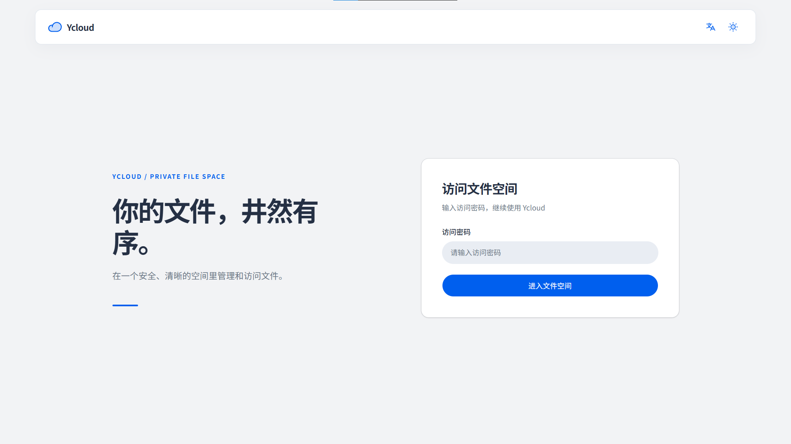
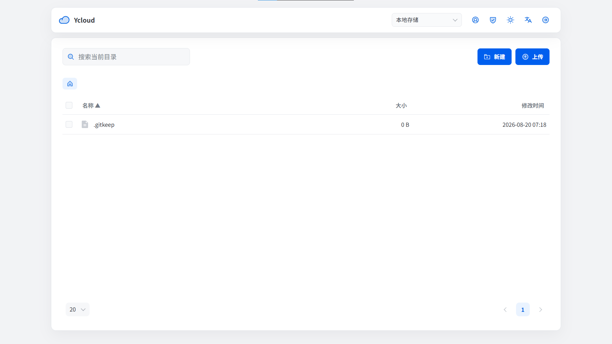
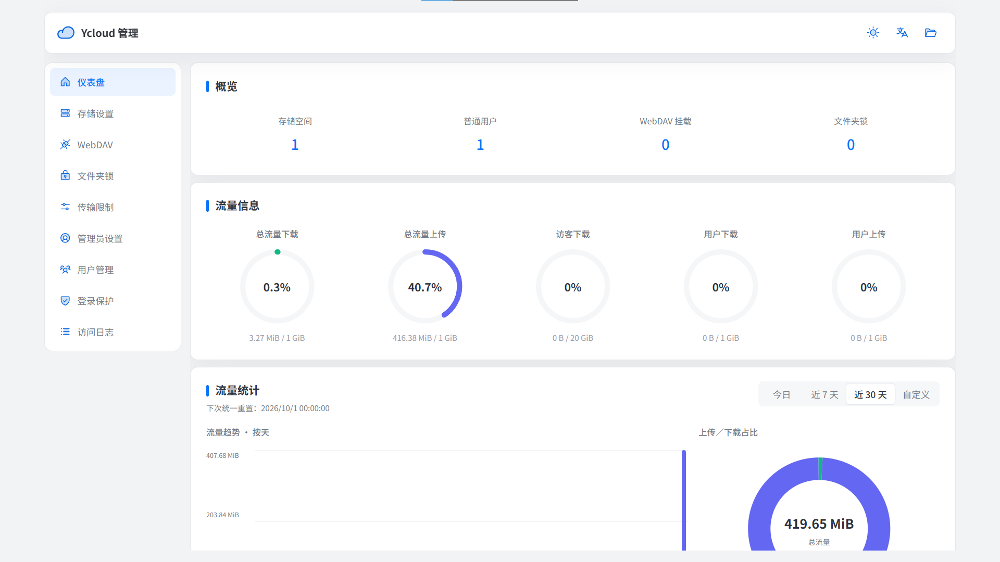

# Ycloud

Rust + Vue 构建的自托管文件管理服务，支持本地存储和 S3 兼容对象存储。

## 支持范围

- 生产部署：Linux 原生进程、Docker、Docker Compose。
- Windows：开发、编译和本机运行。

## Windows 开发运行

```powershell
cd Ycloud-v2
cargo run --release --locked
```

访问 `http://127.0.0.1:18473`。首次启动凭据位于 `initial-credentials.json`。

## 功能

- 本地存储、阿里云 OSS、腾讯云 COS、MinIO、RustFS 和通用 S3。
- 上传、下载、预览、搜索、移动、复制、重命名、删除和 ZIP 归档。
- 管理员、访客、普通用户和 WebDAV 独立授权。存储的“允许访客访问”只控制无账号的网页访客，不替代 WebDAV 挂载自身的用户名和密码；停用存储后，所有入口都会拒绝新操作。
- 文件夹锁、TOTP、登录限制、访问日志和传输限制。
- 流式传输、本地原子写入、事务恢复和 S3 Multipart。

文件页右上角的用户图标用于普通用户登录，登录后点击查看账号及当前存储权限；盾牌为管理员入口。普通用户由管理员创建，两个入口分别验证对应角色的账号。

## 界面

<table>
  <tr>
    <th>访客入口</th>
    <th>文件管理</th>
  </tr>
  <tr>
    <td></td>
    <td></td>
  </tr>
</table>

管理后台概览：



## Docker Compose

```bash
mkdir -p data
sudo chown 10001:10001 data
sudo chmod 700 data
docker compose up -d --build
docker compose ps
```

访问 `http://服务器IP:18473`。读取首次启动凭据：

```bash
sudo cat ./data/initial-credentials.json
```

修改管理员密码和网页访问密码后，该文件自动删除。`./data` 包含配置、主密钥、本地文件和运行状态，备份时整体处理。

## Linux 原生运行

```bash
cargo build --release --locked
BIND_ADDRESS=0.0.0.0 ALLOW_LAN_HTTP=true ./target/release/ycloud
```

默认配置和存储目录为当前目录下的 `config.json`、`storage/`。

## 部署配置

| 变量 | 用途 |
| --- | --- |
| `BIND_ADDRESS` | 监听地址；原生运行默认 `127.0.0.1` |
| `PORT` | HTTP 端口，默认 `18473` |
| `CONFIG_PATH` | 配置文件路径 |
| `STORAGE_PATH` | 默认本地存储路径 |
| `ALLOW_LAN_HTTP` | 允许非回环地址直接使用 HTTP |
| `ALLOWED_HOSTS` | 允许的内网 Host，多个值用逗号分隔 |
| `LOCAL_STORAGE_MOUNTS` | 后台可选本地挂载点的 JSON 数组 |
| `S3_ALLOWED_ENDPOINTS` | 自建 S3 Endpoint 白名单，多个值用逗号分隔 |
| `RUST_LOG` | 日志级别 |

Dockerfile 已设置容器内的监听地址、端口和数据路径，普通 Compose 部署只需 `ALLOW_LAN_HTTP=true`。

### HTTPS 反向代理

也可以先通过内网地址登录后台，在 **管理员设置 → 域名绑定** 中填写
`https://cloud.example.com` 和 Ycloud 实际收到连接的反向代理 IP。
支持非默认 HTTPS 端口，暂不支持多个域名。先完成 DNS、证书和反向代理配置；
Ycloud 不会自动操作 DNS 或申请证书。

点击确认后立即保存并生效，无验证等待期，也不会自动恢复旧配置。
此后文件页、后台、API 和 WebDAV 仅接受该域名，内网 IP 直连关闭，请通过新域名重新登录。
保存前请核对域名及代理 IP；程序仅校验配置格式，不主动请求域名验证连通性。

确认后的配置保存在数据目录的 `config.json` 中，优先于部署时的域名配置，
并自动应用 HTTPS 代理模式及 Secure Cookie，无需为此修改容器环境变量或重建容器。
可信代理必须填写准确 IP（最多 16 个），不能填写访客 IP、通配地址或任意网段。
容器代理 IP 变化时需重新设置。后台可以解除绑定，解除后恢复部署变量配置。

如果已确认的域名后来失效，可停止服务，将持久化 `config.json` 的
`domain_binding` 改为 `null`，再启动服务恢复部署配置；不要删除整个配置文件。
若原部署变量仍指定公网域名，也需相应调整原变量。该功能不修改容器端口映射或监听地址。

以下是仍然支持的环境变量部署方式：

Ycloud 不内置 TLS。反向代理模式需要同时设置：

```env
ALLOW_LAN_HTTP=false
SECURE_COOKIES=true
PUBLIC_BASE_URL=https://cloud.example.com
TRUSTED_PROXY_IPS=172.18.0.1
```

代理必须传递原始 `Host`、单值 `X-Forwarded-For` 和 `X-Forwarded-Proto: https`。

### 配置主密钥

单机自动生成主密钥并保存在数据目录。Docker、集群或外部密钥管理场景可设置 `YCLOUD_CONFIG_KEY_FILE`，也可用 `YCLOUD_CONFIG_KEY` 覆盖。密钥为 32 个随机字节的 URL-safe Base64；密钥丢失后，已加密的 S3 SecretKey 和 TOTP 密钥无法恢复。

### 存储

文件下载及 WebDAV 文件读取统一返回附件响应和内容隔离响应头，文件原始字节不变；直接用浏览器访问 WebDAV 文件地址会下载文件。预览使用独立的类型策略，不由 S3 对象的 Content-Type 元数据决定是否可内联展示。

额外挂载点示例：

```env
LOCAL_STORAGE_MOUNTS=[{"id":"archive","name":"Archive","path":"/srv/ycloud/archive"}]
```

自建 S3 示例：

```env
S3_ALLOWED_ENDPOINTS=http://192.168.2.37:9000
```

阿里云 OSS 和腾讯云 COS 使用与 Region 对应的官方 HTTPS Endpoint。同一 Bucket/Prefix 只允许一个 Ycloud 实例写入。

### 传输上限

后台可调整业务上限；以下变量定义后台不可突破的部署上限：

- `MAX_UPLOAD_BYTES`
- `MAX_UPLOAD_BATCH_BYTES`
- `MAX_UPLOAD_BATCH_ENTRIES`
- `MAX_ARCHIVE_BYTES`
- `MAX_ARCHIVE_ENTRIES`

## 检查

```bash
cargo fmt --all -- --check
cargo clippy --locked --all-targets -- -D warnings
cargo test --locked
cargo build --release --locked

cd frontend
npm ci
npm run check
```

前端构建产物写入 `static/app` 并嵌入 Rust 可执行文件。

项目结构见 [ARCHITECTURE.md](ARCHITECTURE.md)，开发规则见 [CONTRIBUTING.md](CONTRIBUTING.md)。

## 流量额度与统计

管理后台默认进入“仪表盘”：上方显示资源概览，中部以总流量、访客、用户三个卡片展示五个独立圆环，下方提供按日上传／下载柱状趋势和占比环图；日期使用项目自有选择器。“传输限制”集中设置全站、访客共享下载、普通用户共享总额度和账号独立额度。共享额度与账号额度同时生效，上传／下载独立，0 表示不限额；关闭限制仍记录用量。访客没有上传权限，不使用 IP 额度。

管理员流量计入全站统计，但不受流量额度限制；独立 WebDAV 仍受全站额度限制。所有身份共用可配置的小时／天／月重置周期和起始时间（固定时区偏移），改周期不立即清零；日统计筛选与额度重置互不影响。

存储可分别设置“允许访客访问”和“允许访客下载”。仅开启访问时可浏览文件列表，不能获取文件内容（下载、预览、打包均拒绝）；开启下载必须先允许访问，关闭访问同时关闭下载。旧配置保留既有访问／下载行为，新建存储的访客下载默认关闭。此设置不改变账号用户或独立 WebDAV 权限。

配置目录中的 `traffic-usage.json` 和 `traffic-usage.jsonl` 保存用量；备份应停服并一并保存配置和账本，勿单独删除或恢复旧账本。损坏或持久化失败会停止传输，不能靠重启清除额度。计量是应用文件内容字节，不等于运营商流量；中止时可能保守计入尚未被对端接收的最后一帧。同步记账的真实 NAS 吞吐和断电恢复仍需部署验收。
