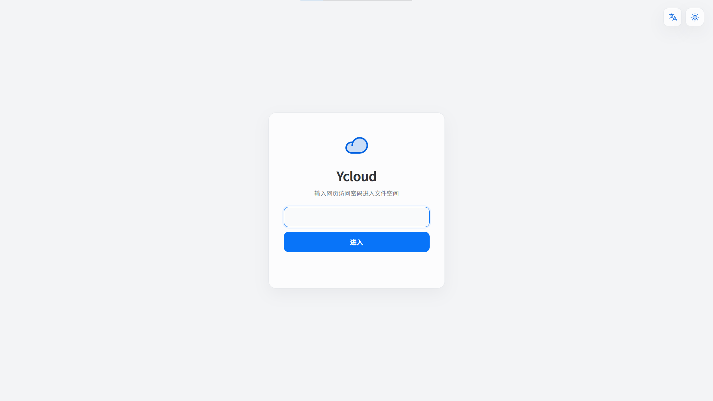
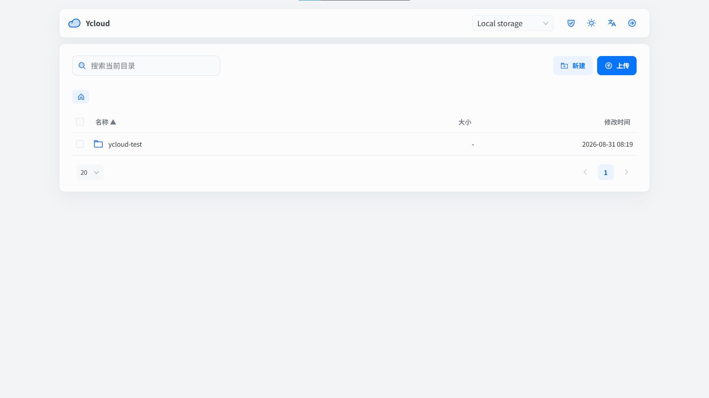
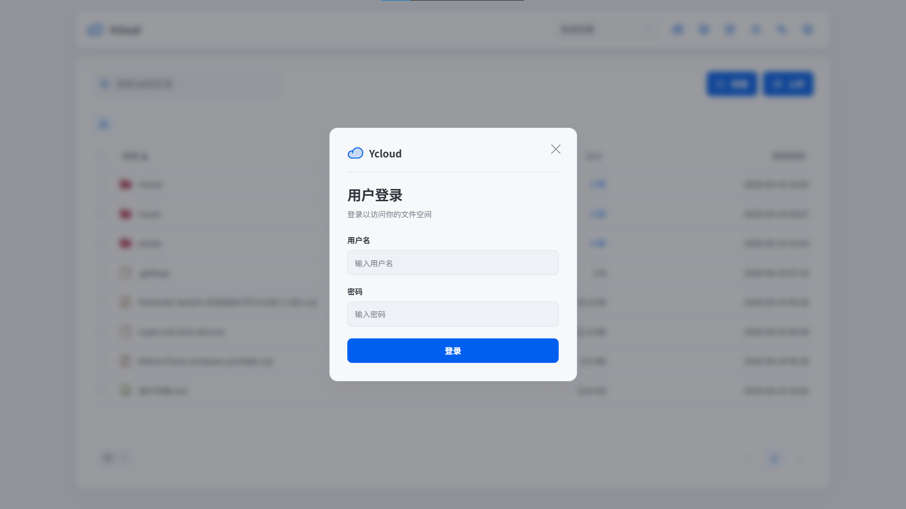
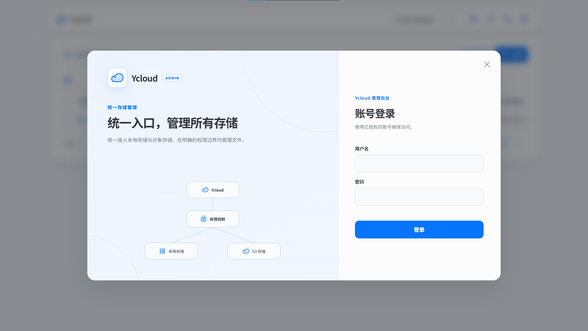
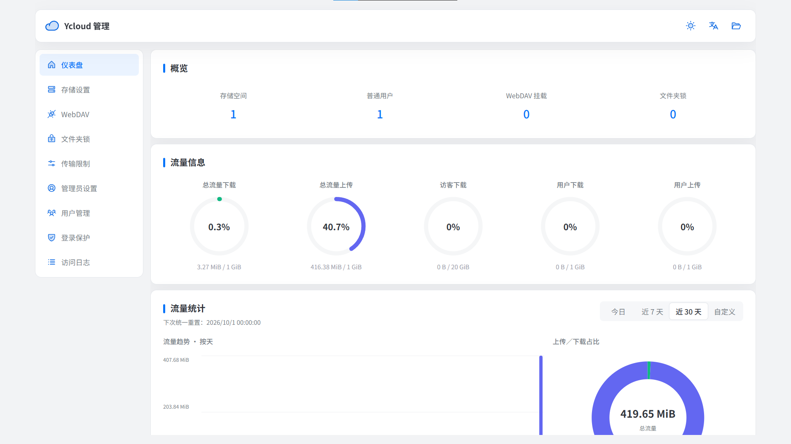

# Ycloud

Rust + Vue 构建的自托管文件管理服务，支持本地存储和 S3 兼容对象存储。

## 功能

- 本地存储、阿里云 OSS、腾讯云 COS、MinIO、RustFS 和通用 S3。
- 上传、下载、预览、搜索、移动、复制、重命名、删除和 ZIP 归档；文件页可切换为每页 20 张的图片画廊，支持 JPG、JPEG、PNG、WebP、AVIF 和 GIF。
- 管理员、访客、普通用户和 WebDAV 独立授权。存储的“允许访客访问”只控制无账号的网页访客，不替代 WebDAV 挂载自身的用户名和密码；停用存储后，所有入口都会拒绝新操作。
- 文件夹锁、TOTP、登录限制、访问日志和传输限制。
- 流式传输、本地原子写入、事务恢复和 S3 Multipart。

网页上传同名文件时自动另存为 `文件名 (编号).扩展名`，从已有最大编号继续递增，不覆盖原文件；上传任务显示实际保存名称。WebDAV 保持客户端原有的写入语义。新建 S3 存储默认由浏览器直传，最多同时发送 4 个分片，基础分片大小为 64 MiB，超大文件按分片数量限制自动增大。中转上传边接收边转发，不缓存完整分片。实时速率表示浏览器发送速度，不代表对象存储已完成提交。

在线修改存储名称、权限和额度会复用现有后端；停用阻止新请求，已开始的操作仍按原连接收尾。更换连接或删除存储时，若还有操作正在执行或上传结果未确认，会提示稍后处理。暂停后未开始的上传凭证过期可以重新准备；已经提交但结果未知的任务不会自动重传。上传队列按原始目标去重，不因服务器自动编号而重复排队。

上传掉线由后台自动处理，不需要管理员核对：未完成的临时上传及 S3 分片自动清理；直传分片已全部传齐但最后确认命令丢失时，等待上传空闲超时后自动检查、提交。提交结果不确定时，后台每 15 秒尝试恢复并同步任务状态，S3 通过任务标识及大小确认正式对象，本地通过独占恢复及预留目标核对；存储不可达时延后重试，不删除正式文件或其他任务数据。网页重新连接后可读取结果，清理完成的失败任务可以重试。旧人工核对入口已撤除。

每个账号最多保留 4 个未结束的上传批次，同时最多执行 4 个直传文件任务；同账号不同登录会话共享限制，文件内仍为 4 分片并发。超出名额会拒绝新任务，不在服务端无限排队；已有浏览器队列仍有数量上限。部署启动前锁定配置目录，本地存储恢复前另取得存储目录独占锁。请勿部署多个实例管理同一 S3 桶和重叠 Prefix；本地锁不能保护不同机器上的共享 S3 命名空间。

文件页右上角的用户图标用于普通用户登录，登录后点击查看账号流量：外圈下载、内圈上传，中间显示使用百分比，下方显示已用量和独立账号额度；后台用户列表分列显示额度及当前周期已用量。全站和用户共享额度仍同时生效。盾牌为管理员入口，普通用户由管理员创建，两个入口分别验证对应角色的账号。

## 界面

<table>
  <tr>
    <th>访客入口</th>
    <th>文件管理</th>
  </tr>
  <tr>
    <td></td>
    <td></td>
  </tr>
  <tr>
    <th>普通用户登录</th>
    <th>管理员登录</th>
  </tr>
  <tr>
    <td></td>
    <td></td>
  </tr>
</table>

管理后台概览：



## 开发环境与编译

- Rust 与 Cargo：`rust-toolchain.toml` 固定 1.96.1；需安装对应平台的原生编译工具链。
- Node.js：`^20.19.0` 或 `>=22.12.0`；npm：11.17.0。前端依赖以 `frontend/package-lock.json` 为准。
- Docker 部署另需 Docker Engine 和 Compose 插件。

从仓库根目录先构建前端，再编译后端；Rust 会将 `static/app/` 中的前端产物嵌入可执行文件：

```bash
cd frontend
npm ci
npm run build
cd ..
cargo build --release --locked
```

可执行文件位于 `target/release/ycloud`（Windows 为 `ycloud.exe`）。修改前端后需重新构建，并提交更新后的 `static/app/`。

开发时在仓库根目录运行 `cargo run --locked`，另开终端在 `frontend/` 运行 `npm run dev`，访问 `http://127.0.0.1:5173`。Vite 将 API 请求转发到默认的后端地址 `127.0.0.1:18473`。首次启动生成的凭据保存在运行目录的 `initial-credentials.json`，请勿提交。

## Docker Compose

```bash
mkdir -p data
sudo chmod 700 data
docker compose up -d --build
docker compose ps
```

首次部署只初始化账号和配置，不自动添加存储。登录后台后自行添加本地或 S3 存储；删除存储配置不会删除文件。文件页按权限展示存储，并按账号记住最后手动选择的存储。

访问 `http://服务器IP:18473`。读取首次启动凭据：

```bash
sudo cat ./data/initial-credentials.json
```

修改管理员密码和网页访问密码后，该文件自动删除。`./data` 包含配置、主密钥、本地文件和运行状态，备份时整体处理。

容器默认以 root 运行，不强制指定 UID/GID。建议按需在 Compose 中启用 `user: "UID:GID"`，并确保该账号可读写整个数据目录；例如使用 `1000:1000` 时，新建空目录可执行 `sudo chown 1000:1000 data`。已有数据应先备份，再核对文件归属及 NAS ACL，避免盲目递归修改权限。

停止等待时间由用户选择：Compose 中可启用 `stop_grace_period: 60s`；大文件传输场景可考虑 `5m`，最好在传输结束后再停服。不设置时 Docker 默认等待 10 秒，超时会强制终止；延长等待不保证所有任务都能完成。

Compose 默认轮转容器标准输出日志，每份 `10m`、最多 3 份，约 30 MB；这不限制数据目录中的业务访问日志。修改配置后运行 `docker compose up -d --build --force-recreate`，已有容器需重建才能应用日志配置。

### Docker 命令部署

从仓库根目录构建并启动：

```bash
docker build --tag ycloud:local .
mkdir -p data
sudo chmod 700 data
docker run -d --name ycloud --restart unless-stopped \
  -p 18473:18473 \
  --mount type=bind,src="$(pwd)/data",dst=/var/lib/ycloud \
  --log-driver json-file --log-opt max-size=10m --log-opt max-file=3 \
  ycloud:local
```

可选：在镜像名之前添加 `--user UID:GID`、`--stop-timeout 60`，分别选择运行账号和停止等待秒数。数据目录与首次凭据读取方式同 Compose。

## Linux 原生运行

完成上方编译后，从仓库根目录运行：

```bash
BIND_ADDRESS=0.0.0.0 ./target/release/ycloud
```

默认配置和存储目录为当前目录下的 `config.json`、`storage/`。

## 部署配置

| 变量 | 用途 |
| --- | --- |
| `BIND_ADDRESS` | 监听地址；原生运行默认 `127.0.0.1` |
| `PORT` | HTTP 端口，默认 `18473` |
| `CONFIG_PATH` | 配置文件路径 |
| `STORAGE_PATH` | 可供管理员添加的本地挂载路径 |
| `ALLOWED_HOSTS` | 允许的内网 Host，多个值用逗号分隔 |
| `LOCAL_STORAGE_MOUNTS` | 后台可选本地挂载点的 JSON 数组 |
| `RUST_LOG` | 日志级别 |

Dockerfile 已设置容器内的监听地址、端口和数据路径，普通 Compose 部署无需设置访问模式参数。

### 配置主密钥

单机自动生成主密钥并保存在数据目录。容器部署或使用外部密钥管理时可设置 `YCLOUD_CONFIG_KEY_FILE`，也可用 `YCLOUD_CONFIG_KEY` 覆盖。密钥为 32 个随机字节的 URL-safe Base64；密钥丢失后，已加密的 S3 SecretKey 和 TOTP 密钥无法恢复。

### 存储

文件下载及 WebDAV 文件读取统一返回附件响应和内容隔离响应头，文件原始字节不变；直接用浏览器访问 WebDAV 文件地址会下载文件。预览使用独立的类型策略，不由 S3 对象的 Content-Type 元数据决定是否可内联展示。

额外挂载点示例：

```env
LOCAL_STORAGE_MOUNTS=[{"id":"archive","name":"Archive","path":"/srv/ycloud/archive"}]
```

自建 S3（MinIO、RustFS 等）直接在管理员后台填写 Endpoint、Bucket 和访问密钥，无需设置地址白名单。Endpoint 只接受不含凭据、路径或查询参数的 HTTP(S) 地址；内网可使用 HTTP，非可信网络请使用 HTTPS。

S3 直传需要浏览器能够访问所填写的 Endpoint，且存储桶的 CORS 允许 Ycloud 网页来源发起 `PUT` 请求（允许请求头 `*`）。HTTPS 网页需要 HTTPS 存储地址，不能使用被浏览器拦截的 HTTP 混合内容。密钥不交给浏览器；后台只签发绑定临时对象、分片和有效期的上传地址，并核验分片后发布最终文件。

浏览器无法直传、但 Ycloud 服务器能够访问的存储，可以开启“中转上传”，不限于内网存储。升级时已有 S3 配置保留中转模式，新建配置默认直传；直传失败不会自动改用中转。S3 直传不经过 Ycloud 的实时限速，不计入任何流量统计或额度，管理员、普通用户及访客均按相同传输路径规则处理；权限、文件大小及存储容量限制仍生效。中转及 WebDAV 仍按经过服务器的文件数据计量。当前 S3 下载由服务器转发，仍需计量，不能仅因存储类型为 S3 就排除；真正的直链跳转下载不计量。

阿里云 OSS 和腾讯云 COS 使用与 Region 对应的官方 HTTPS Endpoint。同一 Bucket/Prefix 只允许一个 Ycloud 实例写入。

### 传输上限

后台可调整业务上限；以下变量定义后台不可突破的部署上限：

- `MAX_UPLOAD_BYTES`
- `MAX_UPLOAD_BATCH_BYTES`
- `MAX_UPLOAD_BATCH_ENTRIES`
- `MAX_ARCHIVE_BYTES`
- `MAX_ARCHIVE_ENTRIES`

## 检查

```bash
cargo fmt --all -- --check
cargo clippy --all-targets --all-features --locked -- -D warnings
cargo test --all-targets --locked

cd frontend
npm run check
```

## 流量额度与统计

管理员修改存储连接、挂载路径、上传中转模式，或停用／删除存储时，会立即中断该存储的文件传输并禁止新任务进入；不要求用户先传完。未完成上传自动清理，已完成文件保留。名称、容量等不改变连接的设置复用现有实例，不触发启动恢复。删除存储前仍需移除 WebDAV、文件夹锁和账号权限引用。

S3 中转上传（含小文件及 WebDAV 上传）共用进程级内存字节预算：Linux 按主机／容器内存上限的 1/32 自动计算，范围 4–32 MiB；无法读取时使用 16 MiB。读取请求体前预留 1 MiB 窗口，预算满时等待，不继续读入；数据的最后一个引用释放后归还预算，异常和取消也会释放。直传不占此预算。此限制只覆盖应用持有的中转文件数据，不是进程总内存硬上限，TLS、HTTP、SDK 和其他业务仍有开销。

- 限额：全站、访客共享下载、普通用户共享和账号独立额度；上传／下载分开计算，`0` 表示不限额。
- 统计：仪表盘只计经 VPS 的文件传输，用户上传为入站、用户下载为出站；S3 直传及直链跳转下载不计入任何角色的统计或限额。经服务器的下载、预览和打包仍计量。关闭限额仍计量；管理员中转传输计量但不限额，独立 WebDAV 受全站限额约束。这是应用层文件数据统计，不是网卡总流量，不包含系统/API 开销或 S3 中转的后端连接额外流量。
- 历史数据：旧版本没有记录直传／中转类别，无法可靠扣除旧直传量；升级保留现有数据，新规则从升级后生效，按原周期重置。
- 重置与备份：按小时／天／月周期重置，重启不清零。停服备份时需将配置与 `traffic-usage.json`、`traffic-usage.jsonl` 一同保存。

## 开源组件

Ycloud 使用 Vue、Phosphor Icons、Reka UI、Tokio、Axum、AWS SDK for Rust 等开源组件；项目名单和必要许可文本见 [第三方声明](THIRD_PARTY_NOTICES.md)。
